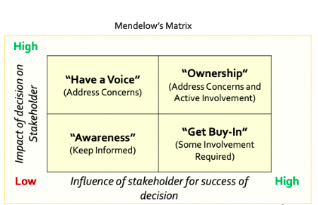
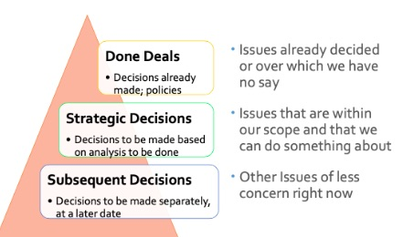
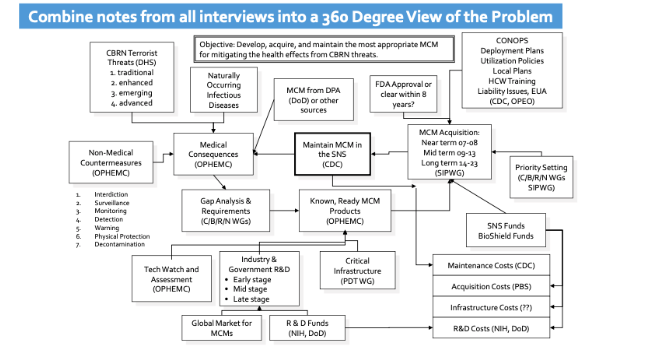

```{r setup, include=FALSE}
library(learnr)
knitr::opts_chunk$set(echo = FALSE)

```

## Business Case

For this tutorial we will work on the MegaTelCo churn problem from *Data Science for Business* (DSB). Here is the description of the case from DSB:

> Assume you just landed a great analytical job with MegaTelCo, one of the largest telecommunication firms in the United States. They are having a major problem with customer retention in their wireless business. In the mid-Atlantic region, 20% of cell phone customers leave when their contracts expire, and it is getting increasingly difficult to acquire new customers. Since the cell phone market is now saturated, the huge growth in the wireless market has tapered off. Communications companies are now engaged in battles to attract each  customers while retaining their own. Customers switching from one company to another is called churn, and it is expensive all around: one company must spend on incentives to attract a customer while another company loses revenue when the customer departs.You have been called in to help understand the problem and to devise a solution. Attracting new customers is much more expensive than retaining existing ones, so a good deal of marketing budget is allocated to prevent churn. Marketing has already designed a special retention offer. Your task is to devise a precise, step-by-step plan for how the data science team should use MegaTelCo’s vast data resources to decide which customers should be offered the special retention deal prior to the expiration of their contracts.

We will need to embellish this case a little to make it work for this tutorial.  Let's add the following details.

- You work on the company's new data science team, headed by JoAnn Wright, a PhD sociologist who is an expert statistician with long experience in business analytics.
- The Marketing Department also has an analytics team.  The folks on that team tend to do simple data summaries, though they will occasionally design  and analyze A/B tests for evaluating marketing campaigns or website design.  This department  is run by Josephine Baker, who has an undergraduate degree in business and has accumulated lots of work experience in marketing.
- The CEO of the company, Joseph Stiglitz, has begun investing heavily in data science, as evidenced by the company's new data science team.  Though he respects Ms. Baker, he would like Dr. Wright to handle the project.  Ms. Baker has grudgingly accepted this arrangement.
- Mr. Stiglitz is not a statistician but is an avid reader of the Harvard Business Review, and has read many articles about the miracles promised by big data and data science. He accordingly has high hopes for the data science team, expecting that the investment in that capability will  help improve the company's operations beyond the basic analytics  currently provided by Marketing. There are, of course, other departments at MegaTelCo that will also benefit from (be consumers of) the analytics provided by the new data science team.
- You are a newly minted graduate from the University of Utah's MSBA program. You would like to impress your new boss, Dr. Wright,  as well as  Mr. Stiglitz, the CEO, and preserve good working relationships with your colleagues in Marketing.  Dr. Wright has privately told you to not accept at face value any of the solutions offered by Marketing.

```{r churn}
quiz(
  question("What is churn?",
    answer("Customers hanging up and calling the switchboard again"),
    answer("Customers signing another contract"),
    answer("Customers switching companies", correct = TRUE),
    answer("Customers switching phones")
  )
)

```

## Business problem  framing

Business problem framing can be more challenging than you think!  This is because there are four factors that are competing for your attention:

1. *Stakeholders.*  Stakeholders will usually define the problem from their own interests and perspective, sometimes making it hard to discern the true problem.  You can make stakeholders part of the solution by doing good stakeholder analysis and interviews.

2. *Problem Complexity.*  Business problems usually have many causes and symptoms. Analyzing the complexity of the problem will help you decide whether the problem is solvable with the available resources.

3. *Analyst Expertise.* "If all you have is a hammer, every problem is a nail."  

4. *Solutions in Search of  Problem.* It is very tempting to simply try to fit an available solution to the problem.  This  re-use of solutions can be efficient, but it can also ignore important nuances of new problems. Be careful that your proposed solution is appropriate for the problem.  


### Initial problem statement

In the case of MegaTelCo  you have been handed a fairly clear-seeming business problem: customer retention in the company's wireless business is poor.   20% of  customers typically do not sign up for the service again when their contracts expire.  Because it it is expensive to acquire new customers, the company would like to  ensure that existing customers renew their contracts. The  marketing department is charged with improving retention, which they  proposed to do by extending  incentives  to existing customers in the form of special offers.

The case indicates that "you have been called in to help understand the problem and to devise a solution."  However, Marketing designed a special offer before you have even had a chance to consider the problem.  Mindful of Dr. Wright's warning, you have resolved to think through all aspects of the business problem.

The first thing that occurs to you to ask is: why is customer churn a problem in the first place?  Well, you think, when the company loses a customer, it loses future revenue. And to replace that revenue through a new customer will cost more than keeping the old customer ("Attracting new customers is much more expensive than retaining existing ones"). You think that it makes sense to spend money on retention up to---but not beyond---the cost to  acquire a new customer.  Also, shouldn't future revenue be considered?  If a particular customer is estimated to be especially profitable, measured in terms of both longevity and monthly expenditures, shouldn't the company spend more to retain them? Has Marketing factored these elements into their planning?  You are not sure.

It occurs to you, additionally, that existing customers  are not all equally likely to  churn.   That is, some customers predicted to churn would not stay even with an offer, which would therefore be wasted on them. So you agree with marketing that one of the analytical challenges for this project is to figure out *which* customers should get the special offer, above and beyond predicting which ones will churn.  

Here is the problem statement you received: MegaTelCo has poor customer retention.
 
After reviewing your information, you come up with the following provisional, revised and refined problem statement:  MegaTelCo is losing future revenue due to poor retention  among  customers who could be persuaded with a special offer to renew their contracts.  Customers who either can't be persuaded or don't need persuading should not be involved in the campaign.

You feel that this is a good beginning, though you know that there are additional complications related to defining the  appropriate customer segment and, based on estimated future revenue for a  given customer, extending an appropriate special offer.   For example, you definitely would not want the cost of retention (the expenditure on the special offer) to exceed  projected future revenue. What if the customer was likely to renew only for another month? That knowledge would surely impact how much you  were willing to spend  on retention. Consequently, it is not clear to you how Marketing could have already designed a retention campaign without understanding customer segments and without some estimate of future revenue for customers.
 
##  Interviews

To start this project you need to gain a comprehensive understanding of the problem---known as a 360 degree view.  To do so you set up interviews with your colleagues and prepare to ask lots of questions. The 5 W's and Heilmeier's Catechism will help:

### 5 W's

You need to think about the problem in terms of the 5 W's: who, what, where, when, and why.

- *Who*: is involved, impacted, or influential?
- *What*: is the problem or opportunity?
- *Where*: will the work take place?
- *When*: are key milestones, deadlines, decisions?
- *Why*: does the problem occur additionally?

### Heilmeier Catechism

Additionally, you should review the so-called [Heilmeier Catechism](https://www.darpa.mil/work-with-us/heilmeier-catechism). These questions were written by George H. Heilmeier, a former DARPA director (1975-1977), to help Agency officials think through and evaluate proposed research programs.

- What are you trying to do? Articulate your objectives using absolutely no jargon.
- How is it done today, and what are the limits of current practice?
- What is new in your approach and why do you think it will be successful?
- Who cares? If you are successful, what difference will it make?
- What are the risks?
- How much will it cost?
- How long will it take?
- What are the mid-term and final "exams" to check for success?


```{r 360}
quiz(
  question("A 360 degree view is...?",
    answer("The result of careful interviewing of stakeholders"),
    answer("A comprehensive understanding of a business problem"),
    answer("Produced by asking and answering the questions in Heilmeier's Catechism and the 5 W's"),
    answer("All of the above", correct = TRUE)
  )
)

```

### Cast of characters

Which colleagues should you interview?  In general, we can distinguish between the following (sometimes overlapping) groups:
 
- *Clients*.  The person who engages you to conduct the project. The client will have his/her own objectives, perspective, and biases that may differ from others in the organization. The client may not be the most knowledgeable person about the problem. Furthermore, the client may not be the decision-maker but only an influencer.

- *Sponsors*.  Often the client will not actually be the person who funds the project, provides access or clearances, or is the problem owner. These other people--- we'll call them sponsors---all have influence on the success of the project.

- *Helpers*.  often you will be  offered support from the client or sponsors in the form of "helpful"  people. Be careful: they may have other agendas or lack the necessary skills.

- *Stakeholders*.  Anyone who has an influence on or is impacted by the solution to the business problem.
 
- *Subject matter experts (SMEs)*. An expert is a person who is an authority in a particular area or topic.

- *Decision-makers.*  The people who will make the important decisions. A decision is defined as: an irrevocable commitment of resources.

### Stakeholders

You know that, of the five W's, the "who" is the most critical to the long term success of the project, especially stakeholders.  Stakeholders  are defined as anyone affected by the project, though they may have different levels of input or involvement during the project. Who are your stakeholders?   You do a quick [stakeholder analysis](https://en.wikipedia.org/wiki/Stakeholder_analysis)  using the following matrix:




Mendelow's Matrix allows you to categorize stakeholders in terms of influence and engagement, and provides guidance on how to manage relationships.

Everyone in the company  is busy, so setting up interviews proves to be a challenge. However, you have arranged to talk to the following colleagues:
 
- Your boss, Dr. Wright. She is your primary client and an important  stakeholder and SME.  You place her in the upper right quadrant of the matrix: "Ownership."

- The Director of Marketing, Ms. Baker.  She is an important stakeholder and SME.   You place her in the lower right quadrant: "Get Buy-In."  She will need to sign off on whatever you recommend but, according to your understanding, you do not answer to her.

- The Manager of the Call Center, Warren Harding.  You involve him because call center operators will probably be involved in the outreach effort.  Mr. Harding will be impacted by the marketing campaign but is not a strong influencer. You place him in the upper left quadrant of the matrix: "Have a Voice."  You will want to pay attention to what he says about the logistical feasibility of the proposed campaign.

- A marketing analyst who has worked on campaigns in the past, Jill Lepore.   Ms. Lepore is an SME. She should be able to provide insight into the data, recount details of past campaigns, as well as provide some perspective on the politics and the company. However, as a  member of the marketing team, she seems suspicious of your new department, which has encroached on the work she used to do.

- The CEO, Mr. Stiglitz. You were unable to get an interview with Mr. Stiglitz. But you know that he is keenly interested in the project. Therefore, you place him in the lower left quadrant of the stakeholders matrix ("Awareness"), and make a note to send him regular  updates, after vetting the progress report with your boss.


```{r matrix}
quiz(
  question("Mendelow's Matrix is...?",
    answer("A data structure"),
    answer("A tool to analyze the stakeholders in a project", correct = TRUE),
    answer("A stand up meeting with SMEs"),
    answer("A technique for conducting interviews")
  )
)

```


###  Interview questions

Your goal in  the interviews is to get more information.  Therefore, you need to be a good listener.  To ensure that you can focus on listening during the interviews you have forced yourself to write down at least 10 interview questions in advance. In your conversation you want to focus on active listening, asking probing  and open-ended questions, and acknowledging positive comments.  These relationship skills will allow you to:

- Establish and maintain rapport.
- Gather personal perception supported by facts and stories.
- Test the findings from other inputs.
- Ask some questions you already think you know the answers to.

You have asked one of your colleagues in your data science group to come with you and take notes. This will free you up to be an active, attentive listener.

One of the things that you will be listening for is distinguish between issues that have been decided, issues that remain to be decided, and issues that can be put off and thought about later. The following decision hierarchy helps formalize these differences:



For example, the campaign to prevent churn is a done deal, but the design might be something that your research can impact.

In addition, you will be trying to assess whether the business problem  needs further refinement from your initial definition, whether it is amenable to an analytics solution, whether you can obtain stakeholder agreement for that solution, and whether you can make a business case for it.


Here are some of the questions you have come up with (not all of them, of course, will be appropriate for all interviews):
 
1. As I understand it, the business problem for this project is how to prevent, or reduce, customer churn.  Does that seem like an accurate description of the problem to you?
2. Are there aspects of the problem that you think I should know about, for example that others in the company might not fully appreciate?
3. What work has previously been done on this problem? 
4. What was the level of success, exactly, for that previous work In terms of identifying customer segments for intervention?  What, in your opinion, should be the benchmark of success for future work?
5. Have there been previous marketing campaigns to curb churn? What was the  methodology and success of those campaigns?  How, in your opinion, could future campaigns be improved?
6. What data exactly is available for this project?  How many fields are there? How far back  In time does the data go?
7. Who would I contact to arrange access to the data and who could answer questions about the data fields?
8. Who else in the company do you think it would be valuable for me to talk with?
9. What is the biggest logistical  or political challenge in implementing a retention campaign?
10. What exactly are the costs associated with the special retention offer?  Are there some that are not obvious?
11. Is there anything else I should know about this problem?

 
### Interview results

In some cases your interviews were lengthy and thorough; in others they were short  and provided little usable information. for example, Mr. Harding was called away after 10 minutes to deal with some crisis in the call center.

Your goal in the next several days is to read through the notes that your colleague made and begin to assemble a 360 degree view of the problem, a map that looks something like this:



 
Here is a brief snapshot of the information you got.

- You shared your refined business problem statement with your boss, Dr. Wright, and  she applauded your work, agreeing that it would be essential to accurately segment the customer population and to take into consideration the cost of the campaign, compared to acquiring a new customer. She like your idea about factoring in the estimated future revenue for a customer, but recommended  keeping the initial analysis fairly simple, and restricting your efforts  to predicting churn for the next subscription period, and taking a stab at segmentation. You suggested using a decision tree to do the classification, and she agreed that would be a good place to start.   She emphasized that it would be crucial to evaluate the accuracy of your estimates of customer churn, as low accuracy could  definitely imperil the success of the campaign.

- Mr. Harding was not very responsive, and had to leave before the end of the interview. You didn't really get anything of value from him, though he did say that you should keep the call script as simple as possible.
 
- You were pleasantly surprised in your meeting with Ms. Baker, the Director of Marketing.  She appreciated your point about customer segmentation, and wondered aloud if  previous campaigns had not done enough to  segment customers based on their likelihood of churning; she thought it possible that resources had been wasted in the past on customers who were either very likely to churn or not at all likely to churn. She liked your idea of focusing on the group that might be persuaded to stay with the appropriate incentive. However, she was also adamant that the data science group  should pay attention to the long experience of analysts in the Marketing Department in running these campaigns,  and insisted that  you   get one of the Marketing Analysts  to sign off on your plans. You mentioned that you were scheduled to meet with Ms. Lepore, and that you would ask your boss to give Ms. Baker a call about  formal collaboration and permission.  (Your boss's comment: "Permission comes from me, not Marketing.")

- You next met with Ms. Lepore, the marketing analyst. She gave you great advice on which data engineer to work with, idiosyncrasies about the data, the meaning of some of the fields with missing  observations, and warned you that Ms. Baker and Dr. Wright do not get along well.  You also learned that, in fact, no customer segmentation had been done for previous campaigns, indicating that the bar would be pretty low for your project to be judged a success. Indeed, it turns out that the last campaign was estimated to have improved retention by just 2%, which seems like an easy performance benchmark to beat. She noted that the company's available data definitely supports a churn analysis: there are abundant historical examples of customers who have not renewed their contracts, along with plenty of demographic, financial and behavioral information.

## Analytics problem framing

### Categories of problems

It is important to be aware of the different  categories of analytical problems.

- *Organizational complexity*. Some problems are hard to solve because they occur in organizations, with difficult group dynamics or a complicated, hierarchical organizational structure, or many stakeholders with differing objectives, perspectives and beliefs. The best time to address the organizational complexity is when you're setting up the project structure.

- *Content complexity*. Some problems are hard to solve because the content is complex, with too much or too little data, many different scenarios each of which have multiple alternatives, few subject matter experts, biases in the data, or constantly evolving industry values and business models/environments.


- *Analytic complexity*.  Some problems are hard because the domain contains high levels of uncertainty, lots of interdependent variables, dynamic business and industry cycles,  or multiple value measures.  

- Then there are so-called *[wicked problems](https://en.wikipedia.org/wiki/Wicked_problem)*.  Wicked problems are poorly defined with roots that are complex and tangled, involve many stakeholders that shared power and opposing views,  have conditions that change with every attempt to address it, or are misunderstood until a solution is in hand.  Moreover, there is often nothing to indicate the right answer to the problem. A wicked problem is a problem that is difficult or impossible to solve because of incomplete, contradictory, and changing requirements that are often difficult to recognize.


```{r complexity}
quiz(
  question("What sort of complexity is involved in  sending astronauts to the moon?",
    answer("content"),
    answer("analytic"),
    answer("organizational", correct = TRUE)
  ),
  question("What sort of complexity is involved in predicting future stock prices?",
    answer("content"),
    answer("analytic", correct = TRUE),
    answer("organizational")
  ),
  question("Is solving a Rubik's cube a wicked or tame problem?",
    answer("wicked"),
    answer("tame", correct = TRUE)
  ),
  question("Is solving  homelessness a wicked or attainment problem?",
    answer("tame"),
    answer("wicked", correct = TRUE)
  )
)

```

Sending astronauts to the moon is  hard because there are (at least) two sources of complexity: the  engineering  challenges are daunting,  and a solution (a successful  moon landing) requires close collaboration  between individuals and groups in  different parts of large organizations.  There are politics, and the potential for catastrophic miscommunication is large.

It is important to understand the sources of the complexity in a problem so that you do not blunder into a project unprepared! What sort of complexity is involved in solving problem of poor customer retention at MegaTelCo?  The problem will probably turn out to be both organizational and analytical. Solving the churn modeling problem---predicting who will churn---is an analytical challenge, albeit  one complicated by  the additional  issue of  exactly how to use that prediction in a marketing campaign. But implementing the intervention is an organizational problem.  Is it a wicked problem? Probably not:  businesses address the sorts of problems every day.

### How

Successfully framing the analytics problem involves following up on the 5 W's by asking a bunch of "How" questions.

- How will we approach the problem?
- How can our analytics methods be applied?
- How can we collect the data needed to do the analysis?
- How will we show/represent the outputs or results?
- How will the models be used--- one time analysis or continuous, real time?
- How will the models be maintained and kept up to date?
- How will we know if we are successful?

### Methods

You understand that predicting churn is a classification problem.  The target variable, retention, is binary: retained/not retained. Thus you are trying to *classify* customers into one of two groups. And the problem is supervised because the data contains past examples of customers who have churned.  The analytical procedure will be to use this historical data to learn the relationship between a set of predictor variables and the binary target variable.  This  defined relationship is the model,  which you will  apply to new data to predict which customers will churn in the future.

At this stage you feel it is not important to be more specific about the analytic approach.  Although you have discussed using a particular methodology with your boss--- decision trees--- you may not end up using that method, instead iterating through different methods and ultimately choosing a different one. For the purposes of the business problem statement it is best to leave methodology unaddressed but characterize the type of problem: classification. 

## Business problem statement

Your next task is to write the business problem statement, which you will circulate to stakeholders for testing. Your hope is that their comments will surface any misunderstandings  or blindnesses that you can address in another---hopefully, the final!---draft of the business problem statement. Ultimately, you want everybody to sign off on your plan.  You also want to set expectations about the process and project deliverables.

What goes into a business problem statement exactly? It is essentially an  informal contract for work. The more specific it is the less potential there is for scope creep later on.  [Scope creep](https://en.wikipedia.org/wiki/Scope_creep): changes to, or uncontrolled growth in, a project's scope after the project begins, which can occur when a project is not initially well-defined.

From the *Analytics Body of Knowledge* (ABOK), Chapter 8:

>A business problem statement is a clear and concise description, typically written in business terms, of the sponsor's business or organizational objectives. The business problem statement defines the key outcomes or accomplishments that are desired, how the organization will measure these outcomes have been reached (for example by specifying business metrics that would be measured and the levels or targets of those metrics that represent success), and all other relevant business issues, such as timeframe, cost constraints, and other business requirements. (278)

There is no fixed format for a business problem statement; rather, you should write the statement that fits the context.  That said, here are the elements that it typically makes sense to include, borrowed from ABOK:

- *Business Problem*: What is the problem?
- *Benefit of a solution*.  How will the business benefit from a solution?
- *Success Metrics*.  How will stakeholders judge whether the project was a success?
- *Analytics Approach*.  What is the general character of the analytics approach to solving the problem?
- *Scope*: What will be delivered and what will be out of scope? What might be added later?
- *Details*: Who is going to execute the project? When will the project be finished? Are there important project milestones?

