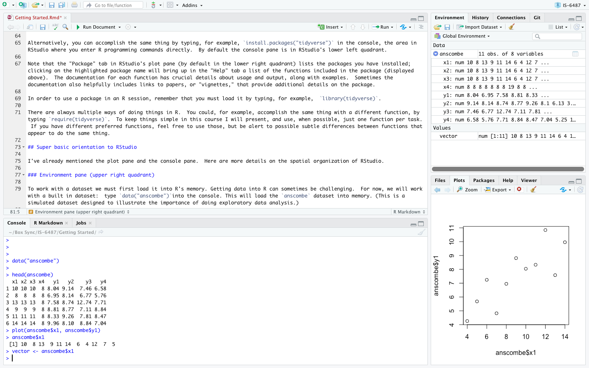

```{r setup, include=FALSE}
library(learnr)
knitr::opts_chunk$set(echo = FALSE)
```

## R and RStudio

### R

R is a free, open source statistical programming language that consists in a set of functions for doing stuff with data: manipulating it, graphing it, and calculating statistics (among other things). Further information on R is available at the [R project](https://www.r-project.org/about.html){target="_blank"} page. 

We will refer to the basic functions included with the version of R that you installed from CRAN as "base R." 

What is a function? In R a function automates a repeated task, like calculating a mean.  You could, of course, calculate a mean by adding up all the values you want to average and then dividing by the number of items.  This is time consuming.  Better to use a function that automatically completes this sequence of steps. In base R the function for calculating a mean is, not surprisingly, `mean()`. (I will use the terms "command" and "function" somewhat interchangeably.)

There are  a very large number of supplementary packages that extend R's usefulness; these must be downloaded and installed separately.  One of the great things about R is that the development community is extremely active and new packages implementing cutting edge techniques are being added all the time. (As of May 2019 there were over 14,000 packages.)

### RStudio

RStudio is an [integrated design environment](https://en.wikipedia.org/wiki/Integrated_development_environment){target="_blank"} (IDE) for R. R can be used by itself (and in fact many people whose workflows predate RStudio prefer to do just that) but RStudio helps improve productivity by  supplying a grahical user interface or GUI for many common tasks as well as project management and authoring tools. We will be using RStudio extensively in this course. 

## Download and install R

Download and install R from the Comprehensive R Archive Network or [CRAN](https://cran.r-project.org){target="_blank"}. Pick the latest release for your operating system.  Here are some example videos from Roger Peng that might be a little dated at this point but demonstrate the basic workflow:

### R for Windows


### R for Mac


## Download and install RStudio

Download and install [RStudio](https://www.rstudio.com){target="_blank"}, making sure to get the desktop version.  Note:  *you must have R installed before you install RStudio*.  Here are some example videos:


### RStudio for Windows


### RStudio for Mac


## Installing packages

When you install R, a large number of functions are automatically included.  As noted, we'll refer to these functions as "base R." While you can perform just about any programming task by writing custom code in base R, there is no need:  many additional functions have already been written and made available in R packages that you can install. One incredibly useful collection of packages is the [tidyverse](https://www.tidyverse.org/packages/){target="_blank"}, which includes:  

- `dplyr` (for data manipulation)
- `readr` (for importing data)
- `ggplot2` (for plotting using the "grammar of graphics")
- `tidyr` (for tidying data)
- `lubridate` (for working with dates)
- `stringr` (for manipulating text)
- and many others!

The functions in these packages work well in combination and are blazingly fast.  For example, the backend in `dplyr`---the tidyverse equivalent of SQL---is written in the C programming language.  These packages allow you to focus on data analysis rather than complicated programming.

Once you've installed RStudio, download and install tidyverse: look for "Tools" in top menu in RStudio and select "Install packages" from the dropdown menu. Browse for the package you want to install. 

{width="100%"}

Alternatively, you can accomplish the same thing by typing, for example, `install.packages("tidyverse")` in the console, the area in RStudio where you enter R programming commands directly, and pressing "return." (You need quotation marks in this case.)  By default the console pane is in RStudio's lower left quadrant. 

The "Package" tab in RStudio's plot pane (by default in the lower right quadrant) lists the packages you have installed; clicking on the highlighted package name will bring up in the "Help" tab a list of the functions included in the package (displayed above).  The documentation for each function has crucial details about usage and output, along with examples.  Sometimes the documentation also helpfully includes links to papers, or "vignettes," that provide additional details on the package.

In order to use a package in an R session, remember that you must load it by typing, for example,  `library(tidyverse)` into the console and pressing "return." (In this case you do not need quotation marks.)

There are always multiple ways of doing things in R.  You could, for example, load the package with a different function: `require(tidyverse)`.  To keep things simple in this course I will present, and use, when possible, just one function for a given task.  If you have different preferred functions, feel free to use those, but be alert to possible subtle differences between functions that appear to do the same thing.  

## Brief orientation to RStudio

I've already mentioned the plot pane and the console pane.  Here are more details on the spatial organization of RStudio. Some of the commands mentioned here will be unfamiliar.  We will come back to these in later lessons; the purpose here is simply to introduce the spatial layout and basic functionality of RStudio.

### Environment pane (upper right quadrant)

To work with a dataset we must first load it into R's memory. Getting data into R can sometimes be challenging.  For now, we will work with a built in dataset:  type `data("anscombe")`into the console and press "return." This will load the `anscombe` dataset into memory. (This is a simulated dataset designed to illustrate the importance of doing exploratory data analysis.)

{width="100%"}


The environment tab in the environment pane in the upper right quadrant shows the objects in R's working memory:

- **Data frames** or other multi-dimensional data structures listed under "Data."  We can see that `anscombe` is a table with 11 observations of 8 variables. 

- **Vectors** or atomic values under "Values."  We took the first column of `anscombe` to create a vector of values stored in the object `vector`.

- **Functions** (none stored in the above example).

Thus, at a glance, we can see the objects in R memory that are available for use.

The environment pane also has a History tab that stores all the commands that have been run during an R session.  This can be useful if you want to look back at what you did during a session and perhaps recover a code snippet that you failed to save.

### Plot pane (lower right quadrant)

The plot pane consists of 5 tabs, the most important of which are:  

- **Files**: shows the files in your working directory.

- **Plots**: displays graphical output.  We have created a scatterplot of `anscombe$x1` against `anscombe$y1` using the `plot()` command. (What does the "$" mean?  This is syntax that tells R to select the `x1` and `y1` columns from the `anscombe` data frame.  More on this later.)

- **Packages**: lists the installed packages. 

- **Help**: contains detailed information about packages and functions.

### Console pane (lower left quadrant)

This is the command line.  You can type R code directly here, then press "return" to run it. Or, code  contained in a source file---for example, from a script file (.R) or an  Rmarkdown file (.Rmd)---can be selected and run in the console using `control-enter.` Output from such code is printed directly to the console.  In the above example, the script contains the command `head(data)`; when this is run `head(data)` appears in the console along with the output---the first 6 rows of `anscombe`.  

In the console, you can scroll up to see previous output, but there are practical limitations to what you can retrieve this way since code and output typically piles up during a session.   The better way to save your work is to write a script or Rmarkdown file in the source pane. (As mentioned above the History tab in the Environment pane will save all the commands run during a session.) 

### Source pane (upper left quadrant)

The document in the above example is entitled `Getting Started.Rmd`.  The source pane shows the document you are currently working on.

To open a new .R or .Rmd file select "File" from the toolbar and then "New File."  Pick the desired document type from the drop down menu.

.R documents are script files that are, essentially, just text files.  These can be shared through email, for example, and the recipient can then open and run them in a local R session.  Script files are a fantastic way to work interactively---running the code in the script, observing the output, and then adjusting the code as necessary.  Save the script to save your work:  the script will enable you  to exactly reproduce your output in a future session. 

## Getting help

RStudio has cheatsheets on many topics.  These are one page summaries of packages or other tools that you can print and keep near your work station for reference.

{width="100%"}

If you would like to learn more about a particular function, type a question mark in the console followed by the name of the function:  `?install.packages`.  This will bring up documentation on the function in the plot pane:  its source package, arguments, details, similar functions, and examples.