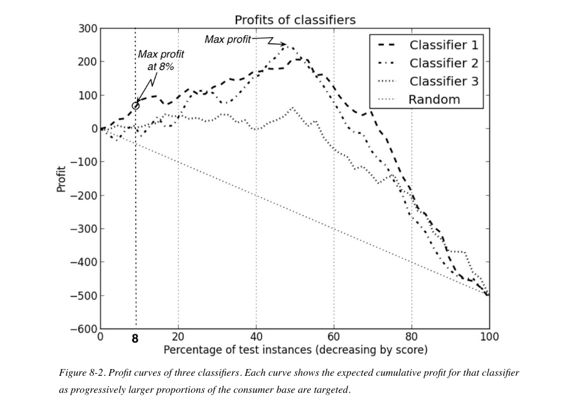

```{r setup, include=FALSE}
library(learnr)
library(knitr)
library(tidyverse)
library(magrittr)
knitr::opts_chunk$set(echo = FALSE)

```

```{r echo=FALSE, message=FALSE, warning=FALSE}
# setwd("~/Box Sync/IS-6487/Data Understanding and Preparation")
# d <- read_csv("megatel_churn.csv")
# 
# d$HOUSE[3321] <- -d$HOUSE[3321]
# d$HANDSET_PRICE[300] <- 2000234
# d$OVER_15MINS_CALLS_PER_MONTH[c(15,150,1500)] <- NA
# d$INCOME[1789] <- -d$INCOME[1789]
# d$ID <- sample(20000, 5000)
# write.csv(d, "megatelco.csv", row.names = F)


```

## Introduction

A key challenge  in an analytics project after creating a model is to figure out what to do with it.  How will we use it to solve the business problem?  What should we recommend the business do?  In asking these questions we have moved from the domain of predictive analytics--- the subject of the last module---to the domain of *prescriptive* analytics,  which is focused on making (to quote DSB) "actionable recommendations based on a data analytic model about what the decision-maker should do to achieve a particular objective." This prescriptive aim *roughly* lines up with the final phases of the CRISP-DM analytics process, Model Evaluation and Model Deployment. I say "roughly" because prescriptive analytics could take place during the CRISP-DM Modeling phase and because deployment can mean a variety of things in analytics projects.  A model might be deployed by writing a report explaining a key relationship  in the data and recommending a course of action, which is clearly prescriptive.  Or it might be deployed by being put into production---for example,  implementing a model to automatically forecast a KPI. This is not clearly prescriptive.  Nevertheless, I would argue that a key feature of any analytics solution should include a prescriptive component, a recommendation for how the analytic results should be used---which course of action, out of the many available, should be taken.  

<!-- Prescriptive analytics is often discussed narrowly as model-based optimization:  using outputs from a predictive model as inputs to a secondary model of a quantity to be maximized, such as profit. But I think prescriptive analytics can be usefully regarded more broadly as any use of quantitative results to make a recommendation.  -->

Consequently, *translation* and *persuasion* are key activities in these later phases of the analytics process. We must translate model results into, and persuade an audience of stakeholders about, recommended actions. This is not simple. It requires that the analyst venture beyond quantifiable inputs and outputs into less certain domains, ones  that require weighing possibilities, exercising business judgment, and making an argument for the best course of action---your  considered recommendation. 

This tutorial will walk you through that process. 

## Preparation

Here is the consolidated code developed in the last tutorial for cleaning the data, fitting a tree model using all predictors, and computing performance metrics.


```{r, echo = T, message=FALSE, warning=FALSE}

# Load packages
library(tidyverse)
library(janitor)
library(rpart)
library(rpart.plot)


# Import and clean data
d <- read_csv("megatelco.csv") %>%
  clean_names() %>% 
  mutate(reported_satisfaction = factor(reported_satisfaction,
                                        levels = c("very_unsat","unsat","avg", "sat", "very_sat"),
                                        ordered = T),
         reported_usage_level = factor(reported_usage_level,
                                       levels = c("very_little", "little", "avg", "high", "very_high"),
                                       ordered = T),
         considering_change_of_plan = factor(considering_change_of_plan,
                                       levels = c("no", "never_thought", "perhaps", "considering", "actively_looking_into_it"),
                                       ordered = T),
         leave = factor(leave),
         college = recode_factor(college, "one" = "yes", "zero" = "no")) %>% 
  filter(income > 0,
         house > 0,
         handset_price < 1000,
         !is.na(over_15mins_calls_per_month)) 


# Fit tree
(tree_model <- rpart(leave ~ ., data = select(d, -id)))

# Confusion matrix
table(predicted = predict(tree_model, type = "class"),
      observed = d$leave) 

# Accuracy
sum(d$leave == predict(tree_model, type = "class")) / nrow(d)


```

## Business Validation

In the last tutorial, we evaluated the tree model using accuracy, a simple classifier performance metric.  But while accuracy allows us to compare models--- for example, the tree model with all the predictors is better than the one with just `house`---it can't answer the  larger, and more important, question of whether this model performance suffices for solving the business problem. At this point we need to do business validation of the model and approach, by checking to make sure that the analytic work we've done solves the initial business problem. It is not untypical for a project to drift, such that the solution no longer fits the problem.  Or, sometimes, we need to redefine the problem in light of the available data and analytics.

So what was the problem? DSB  re-describes it in Chapter 11.

> Why is churn a problem? Because it causes us to lose money. The real business problem is losing money. If a customer actually were costly to us rather than profitable we may not mind losing her. We would like to limit the amount of money we are losing--- not simply to keep the most customers. Therefore, we want to take the value of the customer into account. Our expected value framework helps us to frame that analysis. (284)

The business problem is not churn but the amount of money  the company is losing  due to churn.  We will discuss the expected value framework but will first review probability and model evaluation using the profit metric.


## Probability

In the tutorial for the last module we used a tree model of `leave`  to predict a class label: `STAY` or `LEAVE.` The predicted class label was defined as the majority class in each leaf node of the tree. So, for example, if the majority of customers in a node---say, 6 out of 10---had an observed outcome of `STAY`  then the model would predict `STAY` for those customers and for future similar customers. But it would be easy enough to translate 6/10 into a *probability* rather than a class label. The probability in this case would be a rate derived from the counts in that leaf node: 6/10 represents a probability of .6 that customers in that node would stay.  In this sense, probability is simply an observed rate of  event occurrence in historical data. It can be thought of as a proportion representing that rate, a number ranging between 0 and 1, with 0  indicating the impossibility of the event (never observed) and 1 indicating the certainty of the event (always observed). A probability of .5 represents uncertainty---a coin toss. Translating counts into probabilities in this way makes a tree classification model more flexible and powerful.


<!-- When working with small samples  probabilities of 0 and 1  tend to occur by chance, when in reality probabilities are really never 0 or 1. To avoid this unrealistic result, we use what is known as the Laplace correction: -->

<!-- $$p(c) = \frac{n + 1}{n+m+2}$$ -->
<!-- where $n$ is the number of examples in the leaf belonging to class $c$, and $m$ is the number of examples not belonging to class $c$. -->

### Predicting probabilities

In the last module we used the`predict()` function to extract predicted class labels from the model.  For example:

```{r predict, exercise=TRUE}
#Predict class label
predict(tree_model, type = "class") %>%
  head
```

However, we can easily obtain a *probability* for leaving or staying, calculated as described above, by changing the `type` argument to "prob":

```{r predict-prob1, exercise=TRUE}
# Predict probability -- produces two columns
predict(tree_model, type = "prob") %>%
  head
```

Notice that some of the probabilities seem to be repeated (for example, observations 3-5) and that the probability of `LEAVE`  (in column 1) plus the probability of `STAY` (in column 2) always equals 1. 

1. Probabilities are repeated because if observations wind up in the same leaf node they share the same rate of event occurrence.

2. Staying and leaving are mutually exclusive events since for a given customer one or the other  *must* occur. Thus $p(STAY) + p(LEAVE) = 1$, which means that $p(STAY) = 1 - p(LEAVE)$ and $p(LEAVE) = 1- p(STAY)$.


Formally, when using a model to estimate the probability of staying (or leaving) we are actually estimating that probability given some predictors, with this notation:  $p(STAY | X)$.  This can be read as: the probability of staying given or *conditional upon* (that is what "|" means) a set of predictors, $X$.  

## Confusion Matrix 

Recall that the confusion matrix summarizes model performance by tallying instances where the predictions are correct---true positives (TP)  and true negatives (TN)---and instances where the predictions are incorrect---false positives (FP) and false negatives (FN):

```{r}

cm <- table(predicted = d$leave,
      observed = predict(tree_model, type = "class"))

cm[1,1] <- "TP"
cm[2,1] <- "FN"
cm[1,2] <- "FP"
cm[2,2] <- "TN"

cm 
```


Here is the confusion matrix with actual counts:


```{r tab, exercise = T}

table(predicted = d$leave,
      observed = predict(tree_model, type = "class"))

```

The tree uses the majority class in a given leaf node to model observations in that node. The majority represents a proportion of observations greater than .5, and this proportion, as we've noted, is the estimated probability for the node.  When we use a tree model to predict a class label (`type = "class"`), as here, we are implicitly using a probability threshold, or class decision threshold, of .5.  But there is nothing magic about the .5 class decision threshold for classifying observations.  We could easily have used a different threshold, and using different thresholds produces different sorts of model errors in the resulting confusion matrices.  

First, notice that we can obtain exactly the same confusion matrix as the one above by using a class decision threshold of .5 as the class cutoff. The code says:  if the predicted probability is greater than .5 then predict `LEAVE`, otherwise predict `STAY`.

```{r tab2, exercise = T}

table(predicted = ifelse(predict(tree_model, type = "prob")[,1] > .5, "LEAVE", "STAY"),
      observed = d$leave)


```

What would happen if we used a threshold of, say, .7? This would make it harder for a leaf node to receive a class label of `LEAVE` since in this case 7 out of 10 observations in a leaf node would need to be `LEAVE`, rather than 6 out of 10. The model's predictions of `LEAVE` should therefore go down.

```{r tab3, exercise = T}
table(predicted = ifelse(predict(tree_model, type = "prob")[,1] > .7, "LEAVE", "STAY"),
      observed = d$leave)

```

And they do.  This illustrates a general point. We can manipulate the class decision threshold to change the *sorts* of errors a model makes.  Business validation of a model often involves setting the threshold in a way that, for a particular business problem, maximizes benefits and minimizes costs.

## Profit

Let's get specific about costs and benefits in the MegaTelCo case by supposing that, for purposes of illustration, the incentive proposed by Marketing will cost the company 200 dollars and that retained customers will produce additional revenue of 800 dollars in the next year relative to customers who churn. They produce no revenue.  (The additional revenue for retained customers would be a guess, of course.  Customers likely have different plans, and the data does not include that information.)  Profit for retained customers would thus be 800 - 200 = 600 dollars.  Here is the cost-benefit matrix:

```{r}

cb <- table(predicted = d$leave,
      observed = predict(tree_model, type = "class"))

cb[1,1] <- 600
cb[2,1] <- 0
cb[1,2] <- -200
cb[2,2] <- 0

cost_benefit <- cb

cb

confusion <- table(predicted = predict(tree_model, type = "class"),
      observed = d$leave)

```

True positives are a benefit because those customers, having been correctly identified by the model, are candidates for targeting; they can be convinced to renew.  False positives are a cost because these customers were already going to stay; the incentive will be wasted on them. Moreover, costs and benefits will only be considered for customers predicted to leave---the first row of the table--- since they are the only ones to whom the incentive will be offered.  To estimate profit we simply multiply  the dollar value in each cell by the corresponding number of customers in the confusion matrix. We can calculate profit at the default threshold of .5 by multiplying the two tables together. (Note that this is NOT "matrix multiplication" in the linear algebraic sense, but simply a convenient way of multiplying values in the cells.)


```{r, echo = T}
# Confusion matrix
table(predicted = predict(tree_model, type = "class"),
      observed = d$leave)

# Cost-benefit matrix
cost_benefit

# Profit matrix
table(predicted = predict(tree_model, type = "class"),
      observed = d$leave) * 
  cost_benefit


```

Profit in this case is positive: 974,200.  Let's do the same sort of calculation using the class decision threshold of .7. Does profit go up or down?

```{r echo = T}
# Profit matrix
table(predicted = ifelse(predict(tree_model, type = "prob")[,1] > .7, "LEAVE", "STAY"),
      observed = d$leave) *
  cost_benefit


```

Profit went down: 586,200. 

Notice that our profit estimates will change depending on:

- *The cost matrix.* "While the probabilities can be estimated from data, the costs and benefits often cannot. They generally depend on external information provided via analysis of the consequences of decisions in the context of the specific business problem. Indeed, specifying the costs and benefits may take a great deal of time and thought. In many cases they cannot be specified exactly but only as approximate ranges" (DSB, Chapter 7).
- *The accuracy of a given model*. The more accurate the model the fewer costs (false positives) and the more benefits (true positives), leading to higher overall profit.
- *The decision threshold used to create a given confusion matrix*. The default threshold of .5 may not be ideal. In fact, we need a systematic method to decide  where to set the class decision threshold in order to maximize profit.

### Profit Curve

A profit curve displays the estimated profit associated with a confusion matrix at every possible class decision threshold for a given cost matrix.  Profit curves are useful for comparing classifiers and for determining  what proportion of customers should be targeted  with an offer in order to maximize profit. Figure 8-2 in DSB is an example:



The x-axis in this plot represents subsets of customers arranged from highest to lowest predicted probability (or "score"). The profit curve essentially visualizes what happens to profit when different class decision thresholds are used to decide whether to extend an offer. Because the data is sorted on the probability score, those probability thresholds correspond to different proportions of customers. Here is how DSB summarizes it:

>We can produce a list of instances in the predicted scores, ranked by decreasing score, and then measure the expected profit that would result from choosing each successive cut-point in the list. Conceptually this amounts to ranking the list of instances  by score  from highest to lowest and sweeping down through it, recording the expected profit after each instance. At each cut-point we record the percentage of the list predicted as positive and the corresponding estimated profit. Graphing these values gives us a profit curve. (212)

We will use a profit curve below.

## Expected Value Framework

The expected value framework is basically a method for estimating per customer profit for an intervention such as the MegaTelCo marketing campaign. Unfortunately, the discussion in DSB is difficult to understand.  This is partly due to the complexity of the MegaTelCo case, since we must consider both the benefit of targeting and the benefit of not targeting and, moreover, compute the probability of staying and leaving in each situation.  But the difficulty is also due to the fact that we can't actually estimate those probabilities with the data we have. I will review the expected value framework for the MegaTelCo marketing campaign but then provide a simpler---and hopefully more straightforward example---using the AdviseInvest case.

### Expected value framework: MegaTelCo 

The first thing to recognize is that DSB treats the framework in this case as a conceptual tool  for  refining the business problem rather than as a tool for calculating profit. So don't worry about figuring out how to translate these formulas into code. I will adapt the formulation slightly to make it more straightforward by expressing the probability of leaving if targeted not as $1-p(Stay|x,T)$ but as $p(Leave|x,T)$.  The two expressions are identical.

The expected benefit of targeting is:

$$EB_T(x) = p(Stay|x,T)*(u_{Stay}(x)-c)+p(Leave|x,T)*(u_{Leave}(x)-c)$$

In translation, the expected benefit of targeting a customer, $EB_T(x)$, is equal to:

1. The probability a customer will stay *if targeted* multiplied by the profit if she stays (minus the incentive) 

*plus*

2.  The probability she will  leave *if targeted* multiplied by the profit if she  leaves (minus the incentive). 

Notice that the probability of staying is conditional on being targeted---$p(Stay|x,T)$---yet that is information we do not have (and might be difficult to estimate). We used  the tree model  to estimate $p(Leave)$.   But this formula  requires  something different---an estimate of the probability of whether a customer will respond to the special offer, will stay if targeted.  But to estimate that probability we would need, for example, evidence from prior marketing campaigns. The unavailability of this data in the present case underscores the point that this is a formulation designed to help us think about the business problem, not to be used in an actual calculation.  

Next, we examine the expected benefit of *not* targeting:

$$EB_{notT}(x) = p(Stay|x,notT)*(u_{Stay}(x)-c)+p(Leave|x,notT)]*(u_{Leave}(x)-c)$$

This has a similar interpretation to the equation above for $EB_T$. 

The point of these complicated formulations is to better understand what we are trying to accomplish with the marketing campaign and how we should accomplish it---answering the question, in particular, of which customers should get the special offer. Intuitively, these will be customers for whom the value of targeting (VT), $EB_T(x) - EB_{notT}(x)$, is largest, since these are customers whose probability of staying will be most impacted by the special offer and whom it will therefore be most profitable to target: rather than leaving they stay and continue paying fees. (By contrast, a customer who was already going to stay, even without the offer, will not be profitable to target, nor will it be profitable to target a customer who would not stay, even with the offer.) DSB expresses this result as $VT=\Delta(p)∗u_{Stay}(x)−c$, the change in the probability of staying multiplied by revenue associated with staying minus the cost of the incentive.  Basically $\Delta(p)$ serves as a weight on profitability. Customers with low $\Delta(p)$ will tend to have low profitability while, conversely, customers with high $\Delta(p)$ will tend to have high profitability.

In some respects this is an unsatisfying result because: (a)  we don't know what the future profit of customers will be (some might stay a year, others 10 years, with differing contract values), and (b)  we don't know how responsive individual  customers would be to an incentive (as noted above). Nevertheless, these formulations have helped us decompose, and thereby better understand, the business problem and to think harder about data requirements. Part of the report we write should include a summary of which additional data items would be required to improve model quality and the profitability of future marketing campaigns. 

### Expected value framework: AdviseInvest

Analyzing the AdviseInvest case using the expected value framework is more straightforward.  As a reminder: the analytic objective we identified in the AdviseInvest case was to predict whether a customer would answer a scheduled call from a sales representative. To this end, you created in the previous module a supervised classification tree model of the outcome variable, `answered` (coded `yes` or `no`). How to use this model to solve the business problem is of course an important question---should we  maximize the utilization of the current four sale representatives (as requested by the Director of Sales) or maximize overall profit?  For the sake of illustrating the expected value framework let's assume that our business objective is to maximize profit and that the proposed operational adjustment is to schedule calls with just a subset of customers---those most likely to answer.  If the decision in the MegaTelCo marketing campaign was whether to target, the parallel decision in the AdviseInvest case is whether to call.  The expected value formulation in this case is simpler, since we really only need to estimate the expected benefit of calling, $EB_{C}(x)$.  Logically, the expected financial benefit of not calling, $EB_{notC}(x)$, is 0.  Let's examine this.  The probability we use in the expected value framework is the customer action that generates a return---staying in the MegaTelCo case, purchasing in the AdviseInvest case. 

$$EB_{notC}(x) = p(Purchase|x,notC)*(u_{Purchase}(x)-c)+p(NoPurchase|x,notC)*(u_{NoPurchase}(x)-c)$$

Clearly, if a customer is not called then the probability of purchasing a product is 0, in which case the first term in the above formulation, $p(Purchase|x,notC)*(u_{Purchase}(x)-c)$, evaluates to 0. The probability of not purchasing if not called, $p(NoPurchase|x,notC)$, is 1, but the profit from no purchase, $(u_{NoPurchase}(x)$, is obviously 0, as is $c$, the cost of calling.  (The company expends no resources if no call is made.)  So the second term, $p(NoPurchase|x,notC)*(u_{NoPurchase}(x)-c)$, also evaluates to 0.

Now we can investigate the expected benefit of calling.

$$EB_{C}(x) = p(Purchase|x,C)*(u_{Purchase}(x)-c)+p(NoPurchase|x,C)*(u_{NoPurchase}(x)-c)$$

We can further decompose purchasing behavior by noticing that whether the call is answered plays a role here: a customer who is called but does not answer cannot purchase. This has implications for the business validation of the modeling done in the previous module, illustrating the conceptual importance of the expected value framework. What we really want to model if the objective is to maximize profit is not `answered` but rather a different binary outcome, `purchase`.  The record of customer purchases is available in the dataset so in this case the estimate of per customer profit, $EB_{C}(x)$, could be calculated directly.

<!-- 1. Turn `purchase` into a binary variable: `no` if 0 (which represents no purchase in this dataset), `yes` if not 0. -->
<!-- 2. Fit a classification tree model of `purchase`. -->
<!-- 3. Use the model to estimate $p(Purchase|x,C)$ and $p(NoPurchase|x,C)$.  (Remember that $p(NoPurchase|x,C)$ is just $1 - p(Purchase|x,C)$.) -->
<!-- 4. Identify a dollar amount for each customer for $u_{Purchase}(x)$ based on the type of product purchased. Clearly $u_{NoPurchase}(x)$ will be 0. -->
<!-- 5. Estimate the cost of calling, $c$. -->
<!-- 6. Plug these values into the formula for $EB_{C}(x)$. -->

## What Next?

As DSB says, "Business exigencies may force us to proceed. We need to reduce churn; marketing has confidence in this offer, and we certainly have some data that might inform how we proceed" (287). How shall we proceed? 

We can make some simplifying assumptions:  

1. The future profit for all retained customers will be the same.

2. The cost of the incentive for all customers will be the same.

3. The customers who get the incentive will stay.

These assumptions reduce the expected benefit formulation to the problem of estimating $\Delta(p)$. It makes sense that customers who  are already likely to stay---large model-estimated $p(STAY)$--- will have correspondingly small potential $\Delta(p)$ since their retention behavior can't change much: they were already very likely to stay. Consequently, this analysis  suggests that Marketing should focus on those customers with the highest probability of leaving since, in the absence of further information, they offer the largest potential $\Delta(p)$. The prescriptive analytics part of the project could consist in providing recommendations to Marketing regarding *which customers to contact* and *how to structure the incentive*.

## Which Customers to Contact?

The tree model can be used to produce a ranked contact list of customers. The ranking would essentially provide guidance on how to spend the incentive money allocated for the campaign: spend it on the customers near the top of the list, who are most likely leave and have the largest estimated $\Delta(p)$.  To produce the list, simply add the estimate of $p(LEAVE|X)$ into the original data frame and sort on that variable, known as a "score," selecting the resulting column along with `id`.   Here is example code:

```{r contact, exercise = T}

d %>%
  mutate(probability = predict(tree_model, type = "prob")[,1]) %>%
  arrange(desc(probability)) %>%
  select(id, probability) 
```

The list is organized by the idea that some customers should be targeted---those with a high probability of leaving---and some, who have a low probability of leaving, should not be targeted. But *how many* from the list should be targeted?  That is a key question, and one you should expect to be asked when you present your plan to Marketing.  

## How Many Customers to Contact?

As we saw above, a profit curve can be used to estimate the proportion of customers who should be contacted. We have stipulated that everyone who is targeted will be retained, hence $p(S|x,T)$ = 1. Customers who were correctly predicted to leave (true positives) and were targeted, converting them from `LEAVE` to `STAY`, would thus generate 600 dollars in revenue. Customers who were incorrectly predicted to leave (false positives) and were targeted would  generate -200  dollars in revenue. Customers who were predicted to stay would not be offered the incentive,  and, generating no costs or revenue, can be ignored for evaluating profit. 

The code for a profit curve is tricky to understand, so let's display and explain the underlying data first.

```{r data, exercise= T}
# Define revenue and cost
revenue <- 800
cost <- 200

# Underlying data
d %>%
  mutate(probability = predict(tree_model, type = "prob")[,1]) %>%
  arrange(desc(probability)) %>%
  mutate(profit = ifelse(leave == "LEAVE", revenue - cost, -cost),
         cum_profit = cumsum(profit),
         customers = 1:n() / n()) %>%
  select(probability, profit, cum_profit, customers) 
  


```


Here are the steps:

1. Add predicted probability of leaving, $p(LEAVE)$, to the data.
2. Important:  as in the contact list, the data must be sorted by $p(LEAVE)$, high to low.
3. Calculate a cumulative or running proportion, `customers`, for each row.  The cumulative proportion increases with every row, and is the proportion of the data represented by that row *along with every row above it*. Rows 1-10, for example, together represent .002 of the dataset. This will be the x-axis in the profit curve.
4. Calculate `profit`.  600 dollars if the observed outcome for a row is `LEAVE`, or -200 dollars if `STAY`.
5. Calculate `cum_profit`, a cumulative tally of `profit`. This will be the y-axis in the profit curve.  

Imagine that we are using the probability in each row as the class decision threshold for predicting `LEAVE` such that we predict `LEAVE` for the rows above and inclusive of that row.  In row 5, for example, we would predict `LEAVE` for just 5 rows (1 - 5), `STAY` for all the others (6 - 4994), while in row 6 we would predict `LEAVE` for 6 rows (1 - 6), `STAY` for all the others (7 - 4994), and so on. In effect, we are successively subsetting the data by rows---predicting `LEAVE` for those customers in the selected rows---and computing a profit summary for the selection, contained in the final value of the subset's `cum_profit`.  For example, in the subset consisting in the first 10 rows there were 9 true positives and 1 false positive, so subsetting the data at row 10 would produce combined profit of 9 x 600 + 1 x 200 = 5200, which is the value of `cum_profit` for row 10.  

Here is the  plot.


```{r plot, exercise = T}
# Define revenue and cost
revenue <- 800
cost <- 200

# Make plot
d %>%
  mutate(probability = predict(tree_model, type = "prob")[,1]) %>%
  arrange(desc(probability)) %>%
  mutate(profit = ifelse(leave == "LEAVE", revenue - cost, -cost),
         cum_profit = cumsum(profit),
         customers = 1:n() / n()) %>%
  ggplot(aes(customers, cum_profit))+
  geom_line() +
  labs(title = "Profit Curve for Marketing Campaign",
       x = "Proportion of customers targeted (decreasing by score)",
       y = "Profit") +
  theme_minimal()


```


<!-- ```{r} -->

<!-- # Define revenue and cost -->
<!-- revenue <- 800 -->
<!-- cost <- -200 -->

<!-- # Make plot -->
<!-- d %>% -->
<!--   mutate(probability = predict(tree_model, type = "prob")[,1]) %>% -->
<!--   arrange(desc(probability)) %>% -->
<!--   mutate(predicted= 1:n(), -->
<!--          observed = ifelse(leave == "LEAVE", 1, 0), -->
<!--          TP = cumsum(observed), -->
<!--          FP = predicted - TP, -->
<!--          profit = TP * revenue + FP * cost, -->
<!--          customers = 1:n() / n()) %>%  -->
<!--   ggplot(aes(customers, profit))+ -->
<!--   geom_line() + -->
<!--   labs(title = "Profit Curve for Marketing Campaign", -->
<!--        x = "Proportion of customers targeted (decreasing by score)", -->
<!--        y = "Profit") + -->
<!--   theme_minimal() -->


<!-- ``` -->


The plot reveals what proportion of customers should be targeted in order to maximize profit. When the targeted group increasingly includes customers with a low probability of leaving (traveling right on the x-axis), the costs will begin to overwhelm the  profits and the campaign will have diminishing returns. That happens at about .75 in the plot.

In sum, this profit curve illustrates that you can be confident in your recommendation to Marketing that  profit would be maximized by contacting approximately the top 75% of customers (ranked by the probability of leaving). Moreover, if the budget for the campaign is limited (and budgets are always limited), then contacting just 50% of the customers, for example, would reap nearly the same additional profit. 

## How to Structure the Incentive?

Of course, one of our initial assumptions is dubious: not everyone who receives the special offer will respond by renewing the contract.  Therefore, we should think about how to structure the incentive to make it as appealing as possible to customers likely to churn.  To this end variable importance from the tree model can provide helpful guidance. Why are customers leaving? We saw from EDA, as well as from  the tree model, that customer satisfaction had very little impact on  customer churn.   What about the other predictors that showed a large impact?
 
```{r echo=TRUE}

tree_model$variable.importance
```


`Overage` is interesting.  By definition,  `overage` is a penalty charge, and it would seem to be a pain point for some customers.   The company could potentially adjust  or waive the penalty.  Let's visualize the relationship between overage and the probability of leaving, first adding the model estimated probability into the data frame:

```{r echo =TRUE}
#  Add the probability of leaving
d %>%
  mutate(p = predict(tree_model, type = "prob")[,1]) %>% 
  ggplot(aes(overage, p)) +
  geom_jitter() +
  labs(title = "p(LEAVE) ~ overage") +
  theme_minimal()

```

High overage seems to affect the probability of leaving for some customers but not others.  Perhaps a third variable accounts for the difference, such as other high importance variables: `house`, `income`, high usage (`over_15mins_calls_per_month`).    For ease of visualization we need to bin these continuous variables. `dplyr` has a very handy function, `cut_number()`, that  bins continuous variables into categories with equal numbers of observations.  Our strategy will be to create [small multiples plots](https://en.wikipedia.org/wiki/Small_multiple) to see whether the relationship between `overage` and $p(LEAVE)$ varies by levels of `house`, `income`, high usage.   

```{r echo = T}
# Add categorical variables
d %<>% #This is an assignment operator from magrittr package, same as:  d <- d %>%
  mutate(income_cat = cut_number(income/1000, 4),
         house_cat = cut_number(house/100000,4),
         usage = cut_number(over_15mins_calls_per_month, 4))

glimpse(d)
```

Notice that `cut_number()` has created a factor variable that indicates the numeric range of the bin. We will start by analyzing high usage.


```{r echo =T}

d %>%
  mutate(p = predict(tree_model, type = "prob")[,1]) %>% 
  ggplot(aes(overage, p)) +
  geom_jitter() +
  facet_wrap(~usage) +
  labs(title = "p(LEAVE) ~ overage, varying by usage")

```

Not much here. The basic shape of the relationship between `overage` and $p(LEAVE)$  does not change across levels of high usage.
 
```{r echo =T}

d %>%
  mutate(p = predict(tree_model, type = "prob")[,1]) %>% 
  ggplot(aes(overage, p)) +
  geom_jitter() +
  facet_wrap(~house_cat) +
  labs(title = "p(LEAVE) ~ overage, varying by house")

``` 

This is more promising. We can see that the  relationship between `overage` and $p(LEAVE)$ does depend on house value, such that at lower values of  `house` high `overage` is perfectly associated with high probabilities of leaving. What about `income`?
 
```{r echo =T}

d %>%
  mutate(p = predict(tree_model, type = "prob")[,1]) %>% 
  ggplot(aes(overage, p)) +
  geom_jitter() +
  facet_wrap(~income_cat) +
  labs(title = "p(LEAVE) ~ overage, varying by income")

``` 

Likewise for `income`:  there is a high probability of leaving at high levels of `income`  and high levels of `overage`. What about `house` and `income` together?

```{r echo =T}

d %>%
  mutate(p = predict(tree_model, type = "prob")[,1]) %>% 
  ggplot(aes(overage, p)) +
  geom_jitter() +
  facet_grid(house_cat~income_cat) +
  labs(title = "p(LEAVE) ~ overage, varying by income and house")

``` 

Here we can see that `house`, `income`, and `overage`  together reveal structure in the probability of leaving.   In general, customers with high levels of `overage` have a high probability of leaving.  These customers could be targeted in a marketing campaign with an incentive structure around reducing  or eliminating the  penalty.  There are exceptions, however, so we can be even more specific. The marketing campaign should target customers who:

1. Have over $100 in overage fees per month living in  homes of below average value.
2. Have over $100 in overage fees per month living in homes of above average value, who are in the highest quartile of income.

Let's use these rules to identify customers to target with an incentive designed around `overage`:
 
```{r echo = T}
d %<>%
  mutate(p = predict(tree_model, type = "prob")[,1],
         p = round(p, 2),
         target = ifelse((p > .75 & house/100000 < 4.53) |
                        (p > .75 & house/100000 > 4.53 & income/1000 > 115), "yes", "no"))

table(target = d$target, `probability of leaving` = d$p)
```
 
You could recommend that for these 881 customers Marketing should design a customized incentive centered on `overage.`

