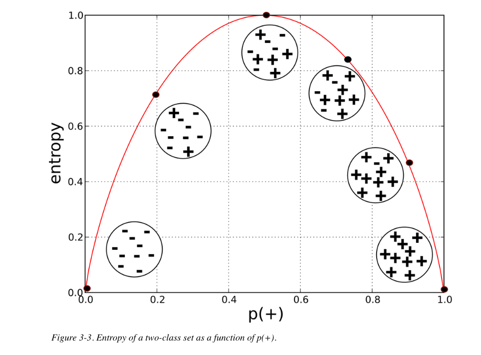

```{r setup, include=FALSE}
library(learnr)
library(knitr)
library(tidyverse)
knitr::opts_chunk$set(echo = FALSE)

```

```{r echo=FALSE, message=FALSE, warning=FALSE}
# setwd("~/Box Sync/IS-6487/Data Understanding and Preparation")
# d <- read_csv("megatel_churn.csv")
# 
# d$HOUSE[3321] <- -d$HOUSE[3321]
# d$HANDSET_PRICE[300] <- 2000234
# d$OVER_15MINS_CALLS_PER_MONTH[c(15,150,1500)] <- NA
# d$INCOME[1789] <- -d$INCOME[1789]
# d$ID <- sample(20000, 5000)
# write.csv(d, "megatelco.csv", row.names = F)


```

## Introduction

In the last tutorial  we cleaned the MegaTelCo data, removing rows with impossible or improbable values, as well as those with missing values.  We then explored the data, learning, among other things, that the churn problem is potentially bigger than the company thinks---the proportion of customers in the data set who did not renew their contracts  was not 20%  (as cited in DSB) but instead around 50%---and that some of the variables that we intuitively expected to be associated with churn, such as customer satisfaction, did not turn out to have much predictive value.  We are now ready to model churn more formally.  The method we will use, as an illustration of modeling generally in the analytics lifecycle, is decision or classification trees, as implemented in the R package, `rpart`. (This is just one of many packages implementing decision trees in R.)  Before we get started, let's remind ourselves of the broader context of what we are doing.

This is a binary **classification problem** because churn has two possible outcomes---represented  in the target factor variable with the class labels, `LEAVE` and `STAY`.    And it is a **supervised problem** because we have historical observations of both leaving and staying, which can be used to  create a model of the relationship between various predictor variables--- demographic, behavioral, and what we have called attitudinal---and the target variable.  The problem can also be described as **supervised segmentation** because we are using that historical data to  create a model that will segment future customers into one of two groups: leave or stay.   (Remember:   if the outcome is continuous  then the problem is a regression problem, not a classification problem.) 

A secondary goal of the analytics project described in the Business Problem Statement was to identify customers most  likely to respond to a special re-enrollment offer.  However, the modeling demonstrated in this tutorial is solely focused on the first goal:  Create a model to predict which customers will churn.

## Data

First, load packages, including `rpart` and `rpart.plot` for fitting and visualizing tree models, and consolidate and run the code developed in the last tutorial for cleaning:


```{r, echo = T, message=FALSE, warning=FALSE}

# Load packages
library(tidyverse)
library(janitor)
library(rpart)
library(rpart.plot)


# Import and clean data
d <- read_csv("megatelco.csv") %>%
  clean_names() %>% 
  mutate(reported_satisfaction = factor(reported_satisfaction,
                                        levels = c("very_unsat","unsat","avg", "sat", "very_sat"),
                                        ordered = T),
         reported_usage_level = factor(reported_usage_level,
                                       levels = c("very_little", "little", "avg", "high", "very_high"),
                                       ordered = T),
         considering_change_of_plan = factor(considering_change_of_plan,
                                       levels = c("no", "never_thought", "perhaps", "considering", "actively_looking_into_it"),
                                       ordered = T),
         leave = factor(leave),
         college = recode_factor(college, "one" = "yes", "zero" = "no")) %>% 
  filter(income > 0,
         house > 0,
         handset_price < 1000,
         !is.na(over_15mins_calls_per_month)) %>% 
  select(-id)

glimpse(d)
```

Looks good.   Notice that I have removed the ID variable: it is an arbitrary number that has no  conceivable predictive relationship with the target variable and would just get in the way during any modeling efforts.  

As a reference, here is the data dictionary:

```{r}
data.frame(Variable = c("College", "Income",  "Overage", "Leftover", "House", "Handset_price", "Over_15mins_calls_per_month", "Average_call_duration", "Reported_satisfaction", "Reported_usage_level", "Considering_change_of_plan", "Leave","ID"),
            Explanation = c("Is the customer college educated?"," Annual income","Average overcharges per month","Average % leftover minutes per month","Estimated value of dwelling (from the census tract)", "Cost of phone", "Average number of long calls (15 mins or over) per month", "Average duration of a call", "Reported level of satisfaction", "Self-reported usage level", "Was customer considering changing his/her plan?","Class variable: whether customer left or stayed", "Numeric customer ID")) %>%
  kable
```


## Tree Model

We will be using the `rpart` package in R, an implementation of the [CART algorithm](https://en.wikipedia.org/wiki/Decision_tree_learning), to fit a classification tree model to `leave` in the MegaTelCo data. (`rpart` stands for "Recursive Partitioning and Regression Trees"; see the [package vignette](https://cran.r-project.org/web/packages/rpart/vignettes/longintro.pdf) for implementation details.)  The model syntax used in this package is typical for R, consisting in a function, `rpart()`, with formula and data arguments.  Formulas in R typically take the form of `y ~ x + z`, with the `y` standing for the variable to be modeled, the tilde indicating "modeled by" or "explained by," and the predictors, here `x` and `z`, included additively.  

Let's demonstrate how to use  `rpart` for classification by fitting a simple tree---call it a stump---of `leave` with just one predictor, `house`, which we noticed in  the previous tutorial seemed seemed related to differences in the outcome. Here is the boxplot:

```{r boxplot, exercise = T}

ggplot(d, aes(leave, house)) +
  geom_boxplot() +
  labs(title = "leave ~ house")
  
```

Here is the tree:

```{r tree, echo=T}
# Fit tree
(tree_model <- rpart(leave ~ house, data = d))

```

I have assigned the model to an object, `tree_model`, which we will use later.  For now, let's work through these simplified results.

- `n =`: n is the number of rows in the data set: 4994.
- `1) root`:  The root node by definition has no split, and consists in the entire dataset: 4994 observations.  The next number, 2468, referred to as "loss" in this output, is the count of misclassifications that would occur if the majority class label in the node, `STAY`, were used for prediction. The proportions of `LEAVE` and `STAY` in the data are .49 and .51, respectively.
- `2) house < 600490`: the first split is on `house` at 600,490, with the left branch (`house< 600,490`) producing a group of size 3306, with loss of 1364 incorrectly classified observations.  The class label prediction for this node is the majority label, `LEAVE`, accounting for almost 59% of the observations in the node. This is a leaf node, as indicated by the asterisk.
- `3) house >= 600490`: the right branch produces a group of 1688, with loss of 526.  The class label prediction for this node is the majority label, `STAY`, accounting for almost 69% of the observations in this leaf node.

As described in DSB, a classification tree can be visualized as an upside down tree with the "root" at the top and "nodes" at each split or decision point, with the "leaves" at the terminal nodes. Here is a visualization of the tree:

```{r tree-plot, exercise =TRUE}
# Plot tree object
rpart.plot(tree_model)

```


66% of the data (3306) is in the left branch and 34% (1688) in the right. The majority class in the left leaf node is `LEAVE`, with 59% of the observations, which is therefore the prediction for all observations falling in this node.  The majority class, and hence the predicted class, in the right node is `STAY` with 69% of the observations.

So, a tree model is super simple to set up in R, though the output can be tricky to interpret.  It helps to have an example handy when interpreting a tree.

Notice that, while our objective is to model `LEAVE` as the outcome or "event" of interest, the model is actually a model of both `STAY` and `LEAVE`, telling us when---according to which values of `house`---to predict one and when to predict the other. 

I'm using the word "predict" here in a possibly misleading way, since this model is not predicting, in the sense of forecasting whether or not a customer will churn in the future, but rather describing when a customer *has* churned.  The model is simply describing patterns in the existing data.  However, the aim of creating such a model is to use it eventually for prediction, so we will loosely refer to the model as "predicting" the outcome in this case even when we already know the outcome.

Let's use this simple tree model to review the concepts of purity, entropy and information gain.

## Purity and Entropy

Purity is a common sense notion.  The leaf nodes in a tree model are pure if they all have the same class label.  If they don't---as in our simple model---then they are impure.  For example, the observed outcomes in the leaf node in the left branch consist in 41% `STAY` and 59% `LEAVE`, and, in the right branch, 69% `STAY` and 31% `LEAVE`.  These leaf nodes are impure, then, but how impure? Entropy answers that question for us, formalizing the notion of impurity.   Entropy ranges between 0 and 1, with 0 indicating  no  disorder (the group is pure)  and 1 indicating maximal disorder (the group is balanced).

Figure 3-3 in DSB is helpful:



In our our tree model, entropy would be 0 if the leaf nodes were either all `LEAVE` or all `STAY`.  The nodes are mixed though, and as the mixture of these two classes increases, so does entropy.  If the two classes were balanced 50-50 within a node (at the top of the curve in 3-3) then the node would have maximum disorder and entropy would be 1. 

Entropy is  formally defined as: $-p_1 log(p_1) - p_2 log(p_2) ...$

Entropy in the two leaf nodes would be:

- Left leaf node:  -.41 x log(.41) - .59 x log(.59) = .68.
- Right leaf node:  -.69 x log(.69) - .31 x log(.31) = .62.

This result makes intuitive sense since entropy is higher in the more impure left node where the classes are more evenly balanced.

## Information Gain

Entropy thus inversely measures the purity of a node: as purity goes down entropy goes up.  It is a node-level metric.  Information gain (IG), by contrast, measures the *change in node purity* resulting from a split. The goal in a creating a classification tree is, of course, to find splits that make nodes with the least possible entropy or disorder (ideally, nodes would be pure, with all of the observations having the same class label). After a split the two nodes (known as children) should together have higher purity (lower entropy) than the original node before the split (known as the parent). We use IG comparatively to evaluate possible splits with the goal of identifying the one split out of many candidates that most decreases entropy (increases purity) in the children relative to the parent. The concept is fairly simple, though the formula looks ferocious and is tricky to use: 


$$IG(parent, children) = entropy(parent) - [p(c_1) entropy(c_1) + p(c_2) entropy(c_2) + ...]$$

The formula combines the weighted entropy in the children (weighted by the proportion of the data in each node) and subtracts it from the entropy in the parent.

The $IG$ calculation or the tree model would be:

- $entropy(parent)$ uses the proportion of `LEAVE` and `STAY` in the parent node, which in this case is the entire dataset: -.49 x log(.49) - .51 x log(.51) = .69.
- $p(c_1)$  is the proportion of observations  in the left branch node: 3306/4994 = .66
- $p(c_2)$ is the proportion of observations in the right branch node: 1 - .66 = .34
- $entropy(c_1)$ from above: -.41 x log(.41) - .59 x log(.59) = .68.
- $entropy(c_2)$ from above: -.69 x log(.69) - .31 x log(.31) = .62.

$IG$ = .69 - (.66 x .68 + .34 x .62) = .03.

This calculation is a little off due to rounding error.  Below is a plot showing the exact $IG$ associated with each potential split on house. The value of `house` at maximum $IG$ is about 600,000 (black dashed line) as identified by the tree model.

```{r}
# Create a data.frame of house prices from min to max by 1000
# and an empty column for storing the corresponding entropy
df <- data.frame(house = seq(min(d$house) + 1000, max(d$house), by = 500),
                 entropy = 0,
                 info_gain = 0)

# Check the data frame
# head(df)

# parent entropy
parent_entropy <- d %>%
  summarize(p1 = mean(ifelse(leave=="STAY", 1, 0)),
            p2 = 1-p1,
            entropy = -p1*log(p1)-p2*log(p2)) %>%
  dplyr::select(entropy) %>% 
  as.numeric

# Set up a loop to compute entropies
for(i in seq_along(df$house)){
  temp <- d %>%
    mutate(predict = ifelse(house > df$house[i], "LEAVE", "STAY"),
           leave = leave) %>%
    count(predict, leave) %>%
    group_by(predict) %>%
    mutate(perc = n/sum(n),
           entropy = -(first(perc)* log(first(perc)) + last(perc)* log(last(perc)))) %>% 
    group_by(predict) %>% 
    mutate(total = sum(n)) %>%
    slice(1) %>% 
    dplyr::select(predict, entropy, total) %>% 
    ungroup %>% 
    mutate(perc=total/sum(total)) 
  
  df$entropy[i] <- -(temp$perc[1] * log(temp$perc[1]) + temp$perc[2] * log(temp$perc[2]))
    
  df$info_gain[i] <- parent_entropy - (temp$perc[1] * temp$entropy[1] +
                                               temp$perc[2] * temp$entropy[2])
}
  


names(df)[3] <- "Information gain"

ggplot(df, aes(house, `Information gain`)) +
  geom_line() +
  geom_vline(xintercept = df[which(df$`Information gain`==max(df$`Information gain`)), "house"], lty=2, col = 2)+
  labs(title="Information gain at different splits on house",
       subtitle="Max IG in red",
       y = "information gain") + 
  theme_minimal()

```


## Greediness

The classification tree algorithm does an efficient search for the best split among all the available predictors---the split that most increases IG.  The search is "greedy" in the sense that the algorithm looks for the best split conditional on all the previous splits. This makes the splits locally optimal, with no guarantee of being globally optimal.

>A greedy algorithm is an algorithmic paradigm that follows the problem solving heuristic of making the locally optimal choice at each stage with the intent of finding a global optimum. In many problems, a greedy strategy does not usually produce an optimal solution, but nonetheless a greedy heuristic may yield locally optimal solutions that approximate a globally optimal solution in a reasonable amount of time. [Wikipedia](https://en.wikipedia.org/wiki/Greedy_algorithm)

In other words, a greedy algorithm always chooses the best step at a given point, which is not necessarily (though probably gets close to) the best step overall.

The tree is finished when the algorithm can find no additional information gain-improving splits.  The resulting "leaf" nodes ideally define groups that have low entropy.  The majority class in each leaf node will be used as the model's prediction for observations sharing those characteristics in new data when the outcome is unknown.


## Model Accuracy

Is this a good model?  How would we know?  One of the most common measures of classification model performance is accuracy, defined as the proportion of correct classifications (hence ranging from 0 to 1). We can calculate accuracy using the the model output:

```{r echo = T}
tree_model
```

The left branch node has 3306 observations, 1364 of which were incorrect.  The right branch node has 1688 observations, 526 of which were incorrect.  Accuracy will thus be:  ((3306 - 1364) + (1688 - 526)) / 4994 = .62.  62% of the model's classifications were correct, and 1 - .62 = .38 is the proportion of *incorrect* classifications.

This number can be obtained more simply using the `predict()` function.  The `predict()` function extracts from the model object the class label prediction for each row:


```{r echo = T}
predict(tree_model, type = "class") %>% 
  head
```

Using this output we can calculate accuracy as follows:


```{r echo = T}
sum(predict(tree_model, type = "class") == d$leave) / nrow(d)
```

This code works because the double equals sign, "==," evaluates to `TRUE` or `FALSE` (in effect it asks: does the predicted value equal the observed value, T or F?), and in R summing a logical vector counts the `TRUE`s.  The code counts the instances where predicted is identical to observed and divides by the number of rows.


## Confusion Matrix

We can, furthermore, summarize the results of any classification model using a confusion matrix, so named because it shows where the model is confused, tallying how many times the model correctly or incorrectly predicts the event happening (in this case the "event" we are interested in predicting is `LEAVE`) and how many times it correctly or incorrectly predicts the event not happening (`STAY`). Notice that there are four possibilities here:

- predict event correctly, known as a "true positive" (TP)
- predict event incorrectly, known as a "false positive" (FP)
- predict no event correctly, known as a "true negative" (TN)
- predict no event incorrectly, known as a "false negative" (FN)

The four possibilities fit into a 2 x 2 matrix:

```{r}
cm <- table(predicted = d$leave,
      observed = rep(c("LEAVE","STAY"), nrow(d)/2))

cm[1,1] <- "TP"
cm[2,1] <- "FN"
cm[1,2] <- "FP"
cm[2,2] <- "TN"

cm 
```

Here are the actual numbers from the tree model:

```{r echo = T}
# Confusion matrix
table(predicted = predict(tree_model, type = "class"),
      observed = d$leave)


```

How to read this?  As indicated by the labels, the model's predictions are in the rows of the confusion matrix, and the observed values from the data are in the columns. The matrix allow us to see what sort of errors the model is making.

- TP: 1942 cases in which the model correctly predicted `LEAVE`
- FP: 1364 cases in which the model incorrectly predicted `LEAVE`
- FN: 526 cases in which the model incorrectly predicted `STAY`
- TN: 1162 cases in which the model correctly predicted `STAY`

Notice that we can obtain accuracy from the confusion matrix also by summing the diagonal from upper left to lower right and dividing by the total:  $Acc = \frac{\sum TP + \sum TN}{\sum Total Pop}$ = (1942 + 1162)/ (1942 + 1364 + 526 + 1162) = .62.

(There are many additional metrics that can be calculated from the confusion matrix.  We won't go into them now.)

To improve this model we would need to boost the accuracy either by increasing the number of true positives or the number of true negatives, or both. Now, at any rate, we have the metrics we need to answer the question we started with:  Is this a good model?  Well, good compared to what?  Accuracy works well in most situations as a comparison metric for model performance.

## Model Improvement

Can we improve the model?   Let's fit a tree model with all the  available predictors. We will use shorthand notation--- "."---for including all the predictors additively: 

```{r echo = T}
# Fit tree
(tree_model2 <- rpart(leave ~ ., data = d))

# Visualize
rpart.plot(tree_model2)
```

This plot is different---indeed the model is different---from the one displayed in Figure 3-18 of DSB.  That is presumably because of differences in software implementation.  Notice in the model summary that there are missing nodes---the count jumps from 13 to 22.  The missing nodes have been "pruned" by the algorithm after growing the tree because they did not improve model performance.

Create a confusion matrix for this model and calculate accuracy.

```{r model2-confusion, exercise=TRUE}

```

```{r model2-confusion-hint}
# Create confusion matrix
table(predicted = predict(tree_model2, type = "class"), 
      observed = d$leave)
```

```{r model2-acc, exercise=TRUE}

```


```{r model2-acc-hint}
# Evaluate accuracy
sum(predict(tree_model2, type = "class") == d$leave) / nrow(d)

```

The model's accuracy has improved to .71. According to accuracy this is a better model than the one with a single predictor, `house`.

What does this mean?  Well, in terms of a marketing campaign, we should be realistic about the fact that something like 30% of the customers predicted to churn, and to whom we might extend a special retention offer, will have been incorrectly classified.  (The number might actually be higher than that; we will ignore the possibility for now that the model might be overfitting.) We need to factor this error--- and uncertainty about how large the error is likely to be in practice---into any recommended approach to improving customer retention at MegaTelCo.

## Variable Importance

We can get a sense of which variables are most important in predicting churn by looking at the tree plot:  the splitting variables closer to the root node are more important. However, the `rpart()` function also automatically calculates variable importance. What matters in this variable importance list is not the actual importance score (the calculation of which is somewhat obscure in this package) but the ranking:

```{r echo = T}
tree_model2$variable.importance
```

Here we can see that `overage` is actually more important factor than `house` with `over_15mins_calls_per_month` coming in third. (This ranking is different from Figure 3-17 in DSB because variable importance in `rpart()` is not identical to information gain.) This ranking can be useful when thinking about what factors might contribute to churn.  However, it is important to understand that variable importance does not imply causation.  For example, we would not want to say that certain housing values cause churn.  Notice that the surprising finding from EDA was confirmed by the tree model:  customer satisfaction is not a predictor of churn.